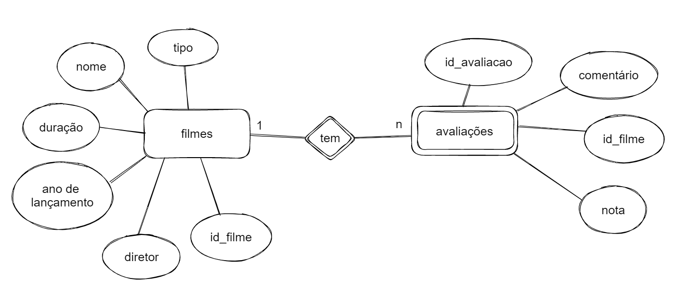

### Sistema de Credenciamento de Filmes e Avaliações 🎬

O projeto utiliza FastAPI para a construção de um backend que possibilita o cadastro de filmes e avaliações desses filmes.

#### Configurações 

Crie um ambiente virtual e instale as bibliotecas necesssárias:

```bash
pip install -r requirements.txt
```

É necessário também a criação de um arquivo `.env` com suas crecenciais de utilização do MySQL. 
```bash
USERNAME = <your_username>
PASSWORD = <your_password>
```

Para a criação da base de dados no MySQL é necessário rodar o seguinte código:
```bash
chmod +x config_database.sh
./config_database.sh
```

Caso ocorra alguma falha com o arquivo acima você pode rodar o script SQL no MySQL Workbench:
```bash
script_sql.sql
```


Para rodar o programa use:

```bash
python main.py
```
O diagrama relacional da nossa base de dados está representado abaixo:



### Vídeo demonstração do funcionamento
Link : https://youtu.be/j6QH8KbigqA
